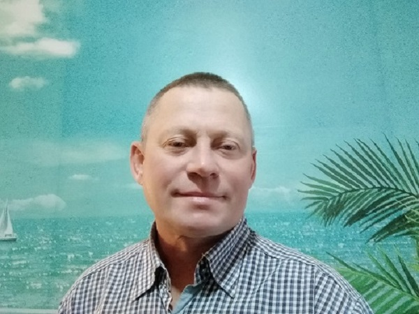

# Низовкин Андрей Викторович

> программист, инженер-геодезист
---
Работая инженером-геодезистом в компании "Ингео"разработал на ЯП VB и внедрил в производство програмное обеспечение для обработки геодезических измерений [Geod](https://geod2000.ru/). По мере развития отрасли развивал его и внедрил новые полезные функции для автоматизации полевых и камеральных работ топогеодезистов.

В 2022г. разработал на ЯП Java новое приложение [Taheoport](https://github.com/AndrewNizovkin/Taheoport.git), которое заменяет [Geod](https://geod2000.ru/).

В настоящее время занимаюсь повышением квалификации, обучаясь на платформе Geek Brains, на факультете разработчик-программист по специальности java-разработчик.
Работаю над разработкой программного обеспечения для импорта и математической обработки геодезических измерений.

Работая инженером - геодезистом в "Ингео", а ранее в подразделении Южного Аэро-Геодезического Предприятия (ЮжАГП), занимался работами, связанными, главным образом, с созданием цифровой модели местности, работал с программами Digitals, AutoCad, Credo, оффисными продуктами Microsoft и пр.;

_Контакты:_
- тел:   +7 928 178 78 45
- email: andreynizovkin@inbox.ru